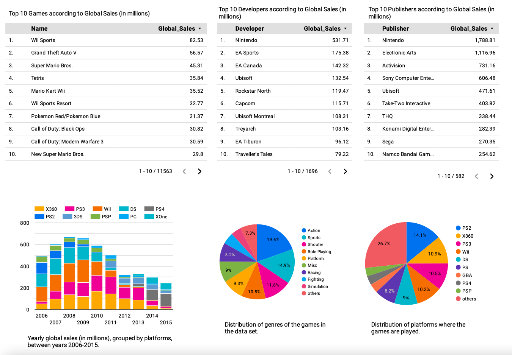

# Data Engineering Project
Note: This is a hands-on project by which I practiced some data engineering concepts following the content from [DataTalksClub](https://github.com/DataTalksClub/data-engineering-zoomcamp).
Please keep in mind that special attention was not paid to the actual analysis, but more to the workflows and tools.

## Data set: Video games sales

This project aims to create a data pipeline using Video Games Sales dataset from Kaggle. The data set and more information about it can be found at this link: https://www.kaggle.com/datasets/sidtwr/videogames-sales-dataset

The data consist of:

- Name: The games name
- Platform: Platform of the games release (i.e. PC,PS4, etc.)
- Year_of_Release: Year of the game's release
- Genre: Genre of the game
- Publisher: Publisher of the game
- NA_Sales: Sales in North America (in millions)
- EU_Sales: Sales in Europe (in millions)
- JP_Sales: Sales in Japan (in millions)
- Other_Sales: Sales in the rest of the world (in millions)
- Global_Sales: Total worldwide sales (in millions)
- Critic_Score: Aggregate score compiled by Metacritic staff
- Critic_Count: The number of critics used in coming up with the Critic_score
- User_Dcore: Score by Metacritic's subscribers
- User_Count: Number of users who gave the user_score
- Developer: Party responsible for creating the game
- Rating: The ESRB ratings

## Data pipeline 

The data pipeline developed in this project can be summarized in 4 steps:
<ol>
<li> Set up the infrastructure in Google Cloud using Terraform
<li> Use Prefect for the workflow orchestration of data ingestion
<ol>
<li> Upload data to Google Cloud Storage (Data lake)
<li> Move data from GC Storage to BigQuery (Data warehouse)
</ol>
<li> Apply data transformations using SQL queries in BigQuery
<li> Create a dashboard using Google Looker Studio
</ol>

At the end of this data pipeline, I would like to gain some insight about the global sales of games.


## Reproducibility:

In order to reproduce this project, apply the following steps:

- First of all, in order to be able to download data sets from Kaggle, run:
```
pip install kaggle
```
- Then, download your `kaggle.json` credentials from Kaggle API, and put that json file in the folder "~/.kaggle/"

- Also, copy the json file which includes your Google Cloud service account credentials into the folder "~/.google/credentials/"

- Create a new folder for this project.

- Clone this GitHub repo:
```
git clone https://github.com/topahande/de-project.git
```

- Move to the folder `de-project` and create a `data` folder:
```
cd de-project
mkdir data
```


### Terraform:
In order to create the infrastructure of the project, Terraform can be used. For that, go to the folder `terraform` and run the following commands:
```
cd terraform
terraform init
terraform plan 
terraform apply
```

### Prefect:
Workflow orchestration for data ingestion was done with Prefect.
Go to the `prefect` folder and create a conda environment with name `de-project`, 
```
cd ../prefect
conda create -n de-project python=3.9
conda activate de-project
pip install -r requirements.txt
```

In another terminal window, run:
```
conda activate de-project
prefect orion start
```
This will generate a local link where you can follow the status of deployments and runs. Open that link in your browser.

In the file `make_gcp_blocks.py`, modify `bucket_name` and `service_account_file` according to your own settings.
In file `etl_gcs_to_bq.py`, modify `project_id` according to your own Google Cloud project ID.

Create Prefect GCS and GitHub blocks:
```
python make_gcp_blocks.py 
python make_gh_block.py
prefect block register --file make_gcp_blocks.py 
prefect block register --file make_gh_block.py
```

In order to download the data set from Kaggle and upload it to Google Cloud Storage, go to the root folder, i.e., `de-project`.

Then, run the following commands:
```
prefect deployment build prefect/etl_web_to_gcs.py:etl_parent_flow --name "web_to_gcs" -sb github/de-project-ghblock --apply
```
In Prefect Orion, in Deployment start a quick run. Then,
```
prefect agent start --work-queue "default"
```

Repeat the same for `etl_gcs_to_bq.py` in order to move the data from GC bucket to BigQuery:
```
prefect deployment build prefect/etl_gcs_to_bq.py:etl_gcs_to_bq --name "gcs_to_bq" -sb github/de-project-ghblock --apply
```
In Prefect Orion, in Deployment start a quick run. Then,
```
prefect agent start --work-queue "default"
```

Alternatively, files can be run locally as normal python files as following:

```
python etl_web_to_gcs.py
python etl_gcs_to_bq.py
```

### Data transformation:
I performed data type transformations when I uploaded the data to GC Storage and then to BigQuery. In addition, I partitioned the data by `Year_of_Release` and clustered by `Platform`, using the following SQL transformation in BigQuery. As I did not need more complex transformations, I have not used dbt or Spark.

I created the partitioned table in BigQuery using the following code (in order to reproduce replace "lithe-breaker-385610" with your own project ID):

```
-- Create a partitioned table from games table and partition it by Year_of_Release and cluster by Platform
CREATE OR REPLACE TABLE lithe-breaker-385610.games_data.games_partitoned
PARTITION BY DATE(Year_of_Release)
CLUSTER BY Platform AS
SELECT * FROM lithe-breaker-385610.games_data.games;
```

### Dashboard:

As the final step, I have created a dashboard using Google Looker Studio.

<p align="center">

</p>


<object data="https://github.com/LadyTastingData/de-project/blob/main/games_data_analysis.pdf" type="application/pdf" width="700px" height="700px">
    <embed src="https://github.com/LadyTastingData/de-project/blob/main/games_data_analysis.pdf">
        <p>The dashboard can be found in pdf format <a href="https://github.com/LadyTastingData/de-project/blob/main/games_data_analysis.pdf">here</a>.</p>
    </embed>
</object>


Alternatively, it can also be found in [Looker Studio](https://lookerstudio.google.com/reporting/ce18b05c-e1f7-4479-b056-c084bc77c3b5).


